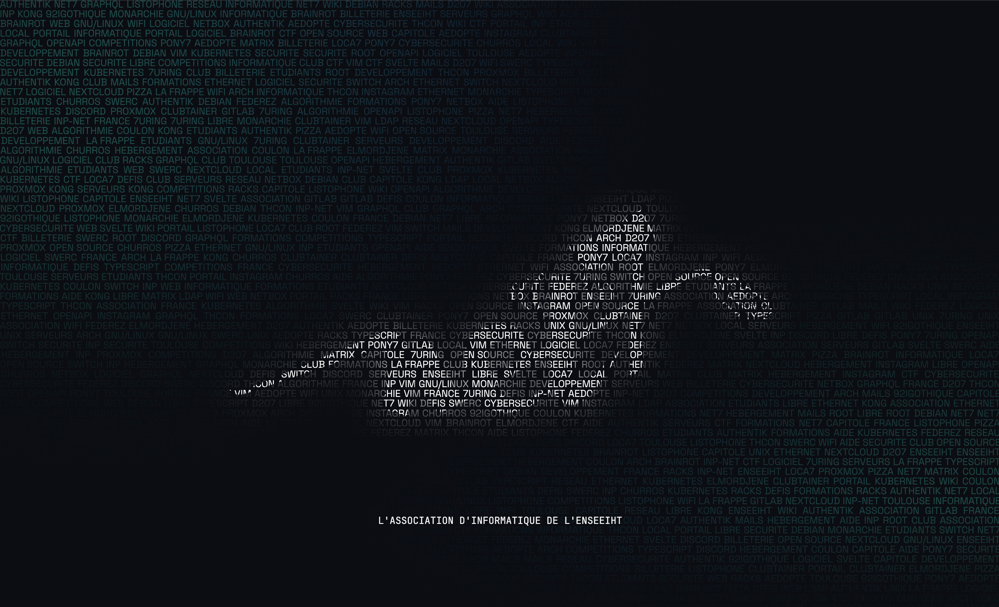

# Site Web net7.dev



Fait avec [Astro](https://astro.build) et beaucoup d'amour !

## Design

Sur [Figma](https://www.figma.com/design/HLV1wHGPpJKZPDdIvyESiD/net7)

## Dev

Le contenu texte du site est facile à modifier, il est écrit sur les pages markdown situées dans `/src/pages/`.

Pour commencer, cloner ce repo sur votre ordi, ensuite installez les dépendances et lancez le serveur de dev avec les commandes :

```sh
pnpm install
pnpm dev
```

Ouvrez la page web à l'URL indiquée et vos changements y seront visibles en temps réel.
